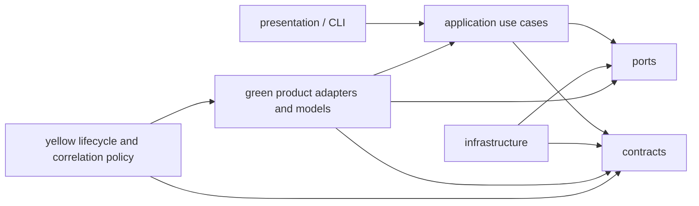
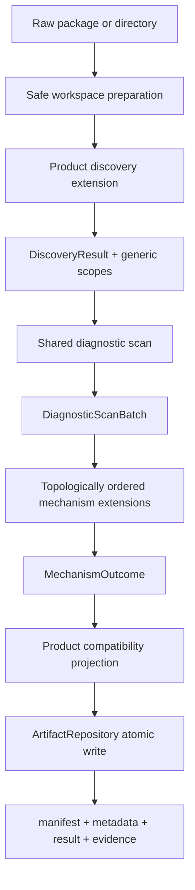

# Architecture

## Purpose

logparse is a deterministic log preprocessing and evidence-indexing system. Its
architecture is product-neutral; current-product topology and mechanism meaning
are extensions maintained in the LAN.

The key separation is:

```text
generic architecture                      current-product extensions
---------------------------------------   -----------------------------------
source/event/scope/result contracts       slot, board, CPU, active/standby
parse orchestration and plugin graph      directory layout and log regexes
safe workspace and artifact repository   Module1 and Module2 policy
query and bounded deterministic DFX       diagnosis knowledge
```

`slot` and `CPU` are not universal logparse concepts. A product adapter may map
them into generic `ScopeRef` levels and emit a compatibility projection for
existing issue-locator consumers.

## Layers and Dependency Direction



The allowed direction is:

```text
presentation -> application -> ports/contracts
infrastructure -> ports/contracts
green/yellow business code -> public contracts and application services
yellow lifecycle/correlation policy -> green current-product models
```

Red application/contracts/infrastructure must not import green or yellow product
implementations. Infrastructure implements ports; extension loading occurs at
the composition boundary. Yellow policy may use stable green product models
because it defines how slot/CPU/topology participates in current-product
lifecycle and correlation.

Target packages:

| Package | Responsibility |
| --- | --- |
| `backend/contracts/` | Versioned DTOs, diagnostics, generic scopes and plugin API |
| `backend/ports/` | Discovery, mechanism, and artifact interfaces |
| `backend/application/` | Parse service, dependency graph, query and DFX use cases |
| `backend/infrastructure/` | Safe extraction, streaming files, artifact layout/repository |
| `backend/domain/lifecycle/` | Protected current-product lifecycle policy |
| `backend/domain/correlation/` | Protected correlation identity and assignment policy |
| `backend/extensions/products/` | Product topology, layouts, patterns and compatibility projections |
| `backend/extensions/mechanisms/` | Module1/Module2 policy for the current product |
| `backend/extensions/diagnosis/` | Product diagnosis knowledge |
| `backend/presentation/cli/` | CLI rendering and command adapters |

Legacy import modules may remain as thin façades while LAN configurations move
to the new paths. New behavior must be implemented in its owning layer, not in a
façade. Plugin base types and mechanism execution stay in red ports/application;
a compatibility base façade and the legacy product Pipeline engine are also red
rather than editable product policy. Current-product engine, artifact writers,
metadata/result serializers, query and deterministic DFX implementations live
beside their compatibility projection, but remain explicit red exceptions
because they protect failure semantics, issue-locator behavior, artifact
integrity, schemas, error codes, and context budgets.

## Parse Flow



Stable contracts:

- `ParseRequest` contains input, output, product, and runtime options.
- `ParseRun` contains status, stages, diagnostics, and artifact inventory.
- `DiscoveryContext -> DiscoveryResult` isolates product discovery.
- `DiagnosticScanBatch` carries a shared scan result and counts.
- `MechanismDescriptor` declares API version, dependencies, capabilities, and
  configuration schema.
- Native mechanism plugins, including current Module1/Module2 and generated
  scaffolds, use `MechanismContext -> MechanismOutcome`. Their context contains
  only bounded product input, dependency results and the shared scan batch; it
  has no mutable `ParseResult`. `LegacyMechanismContext` is an explicit adapter
  only for pre-v1 LAN plugins, and generic orchestration never inspects its
  product state.
- `ScopeRef` is generic hierarchy identity; product projection owns slot/CPU.
- `CycleRef` is stable lifecycle identity and must not use Python object `id()`
  or output directory names as domain identity.

The plugin graph is validated before log scanning. Missing, disabled, or cyclic
dependencies fail early. Module2 declares Module1 as a dependency and consumes
its lifecycle output from `dependency_results`; YAML order and plugin-private
`depends_on_module` are not dependency mechanisms in schema v2.

## Configuration Contract

Schema v2 separates runtime controls from product ownership:

```text
schema_version: 2
pipeline: ...
products.<name>.archive: ...
products.<name>.discovery: ...
products.<name>.parser: ...
products.<name>.mechanisms: ...
```

The root `config.yaml` is a red compatibility index. Its product entries use
relative `$include` files under green `configs/products/`; include resolution
rejects absolute paths, directory escape, mixed inline/include fields, missing
files, and non-object product documents.

The migration removes obsolete output/extraction switches, renames
`active_period_gap_threshold` to `active_period_gap_seconds`, and moves mechanism
dependencies out of plugin-private config. A deterministic compatibility
projection lets the legacy product engine run while LAN configurations migrate.
New product-owned configuration lives under `configs/products/` and is green;
the root compatibility config and migration machinery remain red.

## Extraction and Scanning

- Workspace preparation owns recursive extraction, archive limits, traversal
  protection, symlink protection, and task/output-root containment.
- Discovery and mechanism scanners inspect a prepared workspace only.
- Ordinary `.gz` logs are streamed. Full expansion is an explicit debugging
  option and never the production default.
- Diagnostic logs are scanned once and shared with mechanisms where possible.
- Performance claims must compare input file count, line count, and mechanism
  entry count as well as elapsed time.

## Current-Product Lifecycle Policy

The current product projects its topology as:

```text
slot -> board lifecycle -> optional non-zero CPU -> CPU lifecycle
```

This projection lives in the green/yellow extension area, not in the generic
core. Its protected invariants are:

- empty CPU id and `CPU_Id=0` are board-level;
- only non-zero CPU ids create nested CPU lifecycles;
- Module1 owns V3 lifecycle splitting (`interval_v3`);
- Module2 reuses Module1 board/CPU cycles and does not split independently;
- PID/time fallback, midpoint, unknown assignment, expansion, and clamp are
  explicit policies that require real LAN evidence to change.

## Artifact Model

`ArtifactLayout` is the only path constructor, and `ArtifactRepository` writes
formal JSON artifacts atomically. The task directory is:

```text
output/<task_id>/
├── parse_manifest.json
├── metadata.json
├── result.json
├── mech_modules/
├── performance.json       # --profile only
├── dfx_report.json        # after dfx-output
├── dfx_summary.txt        # after dfx-output
└── dfx_context/           # deep DFX with actual bounded windows only
```

Responsibilities:

- `parse_manifest.json`: status, stages, contract versions, artifact hashes,
  counts, diagnostics, and workspace-retention state.
- `metadata.json`: package/product discovery and scan coverage.
- `result.json`: compact query index; never raw text or per-line `logs[]`.
- `mech_modules/`: selected mechanism evidence using product-projected paths.
- `performance.json`: optional profile values consumed by deterministic DFX.
- DFX artifacts: structured report, one-line summary, and optional bounded
  context. An empty `dfx_context/` is not created.

The extraction workspace is temporary and is removed after successful parsing
unless explicitly retained for LAN debugging. Formal artifacts never depend on
that workspace continuing to exist.

## Governance

`governance/architecture-boundaries.toml` assigns every source path to green,
yellow, or red; unknown source paths default to red. `scripts/change_gate.py`
enforces evidence appropriate to the highest affected zone. See
`docs/lan-development-guide.md` and ADRs 0001–0004.
