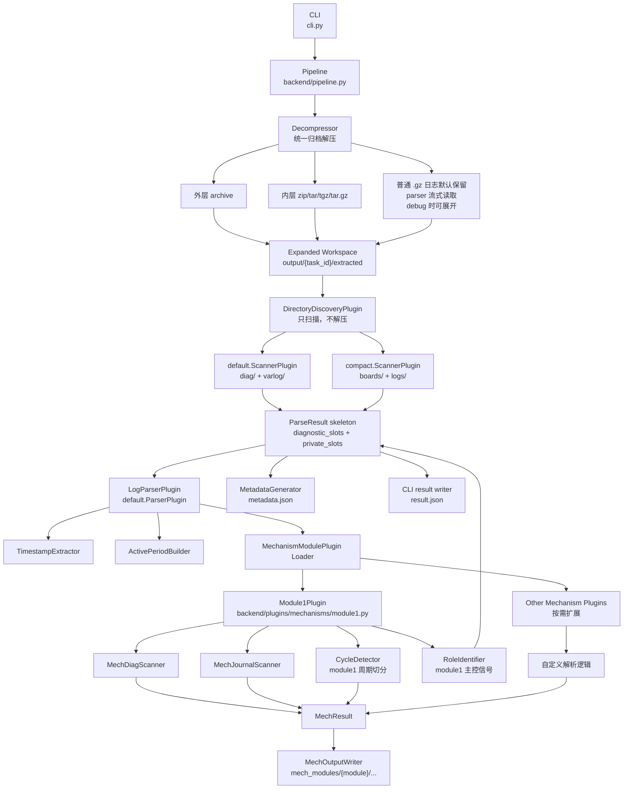

# logparse 架构图

下面是当前完成统一解压和 `module1` 机制模块插件化后的架构。

## 职责边界

- `Decompressor`：负责外层和内层归档包的统一解压；普通 `.gz` 日志默认不展开。
- `DirectoryDiscoveryPlugin`：只扫描统一解压后的工作区，发现 slot、诊断日志和 private/journal 日志。
- `LogParserPlugin`：负责产品级解析编排，提取基础时间戳、构建 `ActivePeriod`，并加载机制模块插件。
- `MechanismModulePlugin`：机制模块自己的扩展点。`module1` 自己拥有特殊日志扫描、周期切分和主控角色信号。
- `MechOutputWriter` / `MetadataGenerator`：负责结构化输出落盘。
