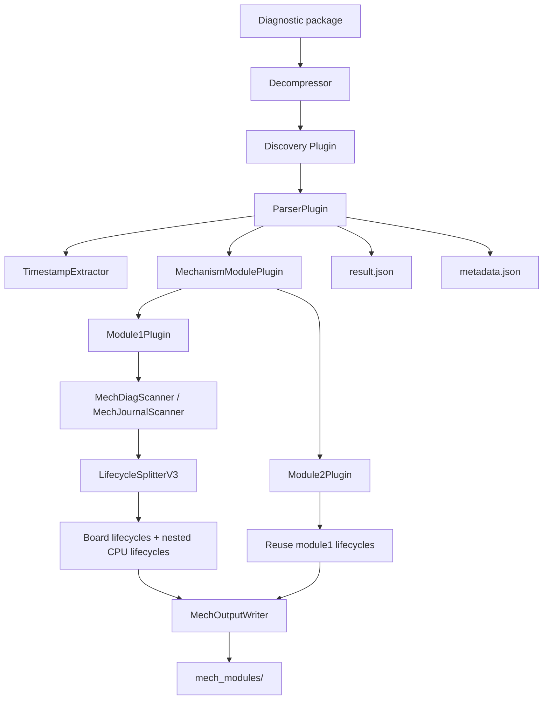

# Architecture Overview

## Boundaries

- `backend/decompressor.py`: owns archive extraction and debug plain `.gz` expansion.
- Discovery plugins: inspect an already extracted workspace.
- `ParserPlugin`: extracts timestamps, builds ActivePeriod, and orchestrates mechanism modules.
- `Module1Plugin`: scans module1 diagnostic/journal logs and always uses `LifecycleSplitterV3`.
- `Module2Plugin`: parses diagnostic logs and reuses module1 lifecycle results.
- `ResultQueryService` and CLI: consume the current V3 `result.json` contract.

## Lifecycle Contract

Only V3 is current. `lifecycle_split` contains `process_name_mapping`, `reliable_processes`, and `multi_instance_processes`. Lifecycle issues are exposed through `lifecycle_split_result.issues`.

Legacy v2 config and rules are archived under `docs/archive/lifecycle-v2/`.
