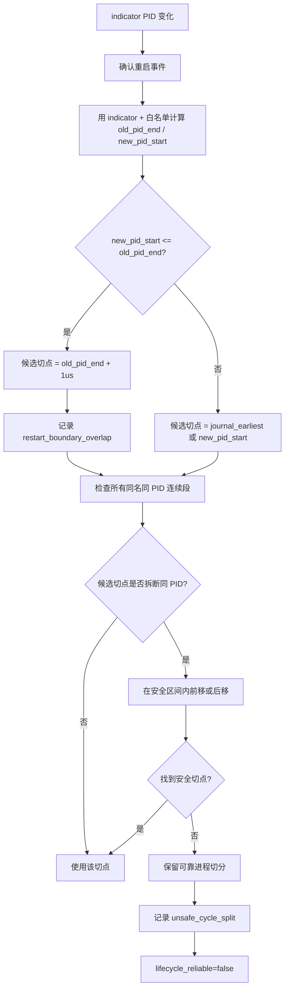
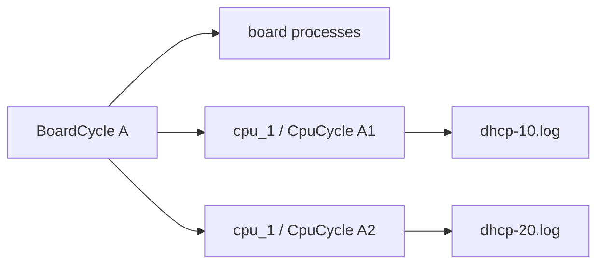

# 生命周期切分逻辑

本文记录机制模块生命周期切分的当前实现规则，重点说明板卡重启边界、安全修正、诊断输出和 CPU 嵌套结构。

## 核心原则

`indicator` 进程的 PID 变化只用于确认“发生了一次重启事件”。最终切分点不能只机械使用 indicator 新 PID 第一条日志，而要尽量满足：任何 `(slot, cpu_id, process_name, pid)` 连续段不被拆断。

初始边界只由可靠进程计算。可靠进程集合为：

- `board_restart_indicator`
- `board_restart_whitelist`

非白名单进程不参与 `old_pid_end/new_pid_start` 计算，但会参与后续安全校验。

## 初始候选切点

对一次可靠进程 PID 变化：

- `old_pid_end = max(可靠进程旧 PID 最后一条时间)`
- `new_pid_start = min(可靠进程新 PID 第一条时间)`
- 正常安全区间为 `(old_pid_end, new_pid_start]`

对每个白名单进程，边界以本次 indicator PID 变化为锚点，但允许白名单进程比 indicator 更早启动、或更晚结束：

- 如果 indicator 变化前观察到的白名单 PID 在 indicator 变化后仍继续出现，说明该 PID 是当前板卡生命周期的新一代；此时取它前一个 PID -> 该 PID 作为本次边界。
- 否则旧 PID 取本次 indicator PID 变化前或同时间戳最后观察到的 PID，新 PID 取之后第一个不同 PID。
- 同一窗口内更早的白名单 PID 自变化不会被当成本次板卡重启边界。

候选切点生成顺序：

1. 若存在 `journal_earliest`，且满足 `old_pid_end < journal_earliest <= new_pid_start`，优先使用它。
2. 否则使用 `new_pid_start`。
3. 若 `new_pid_start <= old_pid_end`，使用 `old_pid_end + 1us`，记录 `restart_boundary_overlap`，并将该 slot 生命周期标记为不可靠。

## 安全修正

拿到候选切点后，会检查当前作用域内所有同名同 PID 连续段。如果切点落在某个连续段内部：

- 优先尝试在安全区间内后移，直到不拆断同 PID 连续段。
- 如果后移会越过可靠进程的新 PID 起点，则尝试在安全区间内前移。
- 如果前移也找不到安全切点，则保留可靠进程重启切分，记录 `unsafe_cycle_split`，并设置 `lifecycle_reliable=false`。

普通日志落在安全区间内本身不算错误。只有发生切点调整、overlap、或无解冲突时才记录诊断。

## 输出模型

板卡周期是顶层生命周期，CPU 周期嵌套在板卡周期内：

- `MechSlotOutput.lifecycle_reliable`
- `MechSlotOutput.boundary_issues`
- `MechBoardCycle.processes` 只放板卡级日志
- `MechBoardCycle.cpu_cycles[].processes` 放 CPU 日志

落盘路径：

- 板卡日志：`slot_1/<board_cycle>/<proc>-<pid>.log`
- CPU 日志：`slot_1/<board_cycle>/cpu_1/<cpu_cycle>/<proc>-<pid>.log`

`module2` 匹配周期时按 `slot + cpu_id + timestamp`：

- CPU 日志优先匹配板卡周期内的嵌套 CPU 周期。
- 板卡日志匹配顶层板卡周期。
- 找不到 CPU 周期时，CPU 日志进入对应板卡周期下的 `cpu_<id>/unknown/`。
- timestamp 不落入任何 module1 周期时，module2 可用 PID 归入最近相邻周期；不能跨过相邻 module1 周期拉回旧 PID。
- module2 输出目录允许按自身日志扩展，但扩展边界会被相邻 module1 周期夹住，保证 module2 周期目录不重叠。

## 流程图

## CPU 嵌套示意

